# Pipeline Process Diagrams

Two process diagrams: the **ideal** 4-tier BNF pipeline (what we want to build) and the **current** implementation (what is actually running), with explicit notes on divergences and the reasons behind them.

---

## 1 — Ideal Pipeline

Full 4-tier funnel from raw public metagenomes to field-ready intervention recommendations. Each tier reduces the candidate pool ~10× while increasing mechanistic resolution.

```mermaid
flowchart TB
    classDef tier fill:#1e3a5f,stroke:#4a90d9,color:#e8f4fd,font-weight:bold
    classDef proc fill:#0d2137,stroke:#4a90d9,color:#c9e6f8
    classDef pass fill:#0a3020,stroke:#2ecc71,color:#a8f0c6
    classDef discard fill:#3a0d0d,stroke:#e74c3c,color:#f5b7b1
    classDef out fill:#2d1b4e,stroke:#9b59b6,color:#dab8f5

    subgraph INGEST["① INGESTION — public databases"]
        I1["NCBI SRA\nshotgun metagenomes\n(millions of samples)"]
        I2["EBI MGnify\nprocessed metagenomes\n(500k+ studies)"]
        I3["NEON / EMP / Qiita\namplicon + paired metadata"]
        I4["Local BIOM/FASTA\nproject-specific sequencing"]
    end

    subgraph T0BOX["② T0 — Composition & Metadata Filter  (µs–ms / sample)"]
        T0A["Sequencing QC\nmin 50k reads · chimera removal\ncontamination screen"]
        T0B["Metadata filter\nsoil pH · texture · land use\nclimate zone"]
        T0C["Functional gene scan\nnifH · dsrAB · mcrA · amoA\npresence / relative abundance"]
        T0D["Diversity metrics\nShannon · Chao1 · Faith PD\nPielou evenness"]
        T0P{"T0\npass?"}
    end

    subgraph T025BOX["③ T0.25 — ML Functional Prediction  (seconds / sample)"]
        T025A["PICRUSt2 / HUMAnN3\nfunctional profile from marker genes\nKO pathway abundances"]
        T025B["Random Forest / GBM\nBNF activity score prediction\nOTU table + metadata features"]
        T025C["Similarity search\nBray-Curtis + UniFrac vs\nreference high-BNF community DB"]
        T025P{"T0.25\npass?"}
    end

    subgraph T1BOX["④ T1 — Metabolic Network Modeling  (minutes / sample)"]
        T1A["Shotgun → MAG binning\nMetaBat2 / SemiBin\nper-sample genome bins"]
        T1B["Genome annotation\nDRAM / Prokka\nKEGG + MetaCyc pathways"]
        T1C["Genome-scale model\nCarveMe / ModelSEED\nfrom annotated genome bins"]
        T1D["Community FBA\nN-limited minimal medium\nbiomass objective\nshared extracellular pool"]
        T1E["FVA on NITROGENASE_MO\nfraction_of_optimum = 0.9\nt1_target_flux = fva_max × 2"]
        T1F["Keystone taxa analysis\nflux deletion scanning\ntop functional contributors"]
        T1G["Metabolic exchange network\ncross-feeding interactions\nN/C/energy coupling"]
        T1P{"target_flux\n≥ 0.01 mmol\nNH4/gDW/h?"}
    end

    subgraph T2BOX["⑤ T2 — Community Dynamics & Intervention  (hours / sample)"]
        T2A["dFBA time-course\n90-day growing season\ncarbon / nutrient depletion curves"]
        T2B["Perturbation screen\ndrought · heat pulse · flooding\npH shift · fertilizer pulse"]
        T2C["Bioinoculant screen\nAzospirillum · Bradyrhizobium\nHerbaspirillum · Paenibacillus"]
        T2D["Amendment modeling\nbiochar pH adjustment\ncompost N release kinetics"]
        T2E["Establishment probability\ninoculant survival in resident community\ncompetitive exclusion model"]
        T2F["Stability + resilience scoring\nresilience = recovery rate\nresistance = flux maintenance"]
        T2P{"stability ≥ 0.6\nestablishment\n≥ 0.4?"}
    end

    subgraph OUTBOX["⑥ OUTPUT — Actionable Recommendations"]
        O1["Top-50 BNF communities\nranked by t1 + t2 composite score\nwith soil context envelope"]
        O2["Intervention report\norganism · dose · timing\ncost/ha estimate"]
        O3["FINDINGS.md\nauto-detected anomalies\ncross-community patterns"]
        O4["Field validation package\nsite selection criteria\nmeasurement protocol"]
    end

    INGEST --> T0A
    T0A --> T0B --> T0C --> T0D --> T0P
    T0P -->|"~10% pass"| T025A
    T0P -->|fail| D0["🗑 ~90% discarded"]:::discard

    T025A --> T025B --> T025C --> T025P
    T025P -->|"~10% pass"| T1A
    T025P -->|fail| D025["🗑 ~90% discarded"]:::discard

    T1A --> T1B --> T1C --> T1D --> T1E --> T1F --> T1G --> T1P
    T1P -->|"~10% pass"| T2A
    T1P -->|fail| D1["🗑 ~90% discarded"]:::discard

    T2A --> T2B --> T2C --> T2D --> T2E --> T2F --> T2P
    T2P -->|"~10% pass"| O1
    T2P -->|fail| D2["🗑 ~90% discarded"]:::discard

    O1 --> O2 --> O3 --> O4

    class INGEST,I1,I2,I3,I4 tier
    class T0A,T0B,T0C,T0D,T025A,T025B,T025C,T1A,T1B,T1C,T1D,T1E,T1F,T1G,T2A,T2B,T2C,T2D,T2E,T2F proc
    class T0P,T025P,T1P,T2P pass
    class D0,D025,D1,D2 discard
    class O1,O2,O3,O4 out
```

---

## 2 — Current Implementation

Same structure, showing what is actually running as of 2026-03-10 (commit `ad31e7b`). Orange nodes = skipped/partial. Red nodes = bugs encountered (now fixed). Green = complete.

```mermaid
flowchart TB
    classDef tier fill:#1e3a5f,stroke:#4a90d9,color:#e8f4fd,font-weight:bold
    classDef proc fill:#0d2137,stroke:#4a90d9,color:#c9e6f8
    classDef pass fill:#0a3020,stroke:#2ecc71,color:#a8f0c6
    classDef discard fill:#3a0d0d,stroke:#e74c3c,color:#f5b7b1
    classDef out fill:#2d1b4e,stroke:#9b59b6,color:#dab8f5
    classDef skip fill:#3a2800,stroke:#f39c12,color:#fdeaa7
    classDef warn fill:#3a1500,stroke:#e67e22,color:#fad7a0
    classDef done fill:#0a3020,stroke:#27ae60,color:#a9dfbf
    classDef bug fill:#3d0000,stroke:#c0392b,color:#fadbd8

    subgraph INGEST["① INGESTION — actual sources"]
        I1["NEON amplicon portal\n16S V4 · 17,567 samples\nneon_adapter.py ✅"]
        I2["EBI MGnify API\n16S amplicon · 95 studies\nmgnify_adapter.py ✅"]
        I3["Synthetic communities\n440,000 simulated samples\nfor model validation"]
        IDIV["⚠ DIVERGENCE\nNo shotgun metagenomes yet.\nSRA adapter exists but unused.\nReason: 16S data was available\nfirst via NEON/MGnify APIs;\nshotgun SRA download pipeline\nnot yet triggered."]:::warn
    end

    subgraph T0BOX["② T0 — Filter  (COMPLETE ✅)"]
        T0A["16S classification\nvsearch vs SILVA 138\n97% identity · SUBSAMPLE_N=10k"]
        T0B["Metadata filter\nsoil pH · land use\nsequencing depth threshold"]
        T0C["Diversity metrics\nShannon · Chao1\nquality_filter.py"]
        T0P{"T0\npass?"}
        T0DONE["11,027 NEON t0_pass\n95 MGnify t0_pass\n440k synthetic t0_pass"]:::done
    end

    subgraph T025BOX["③ T0.25 — ML Prediction  (SKIPPED ⚠)"]
        T025SKIP["functional_predictor.py\npicrust2_runner.py\nhumann3_shortcut.py\n— scripts exist, NOT RUN"]:::skip
        T025WHY["WHY SKIPPED\n16S amplicon → insufficient\nresolution for HUMAnN3.\nPICRUSt2 possible but not wired\ninto BNF config yet.\nML model untrained on BNF target.\nCost: go directly T0→T1 and\naccept higher T1 load."]:::warn
    end

    subgraph T1BOX["④ T1 — Metabolic Modeling  (IN PROGRESS 🔄)"]
        T1A["16S → genus names\nvsearch classification\n(replaces MAG binning)"]
        T1B["Pre-built AGORA2 SBML models\n20 genera on disk\n(replaces CarveMe per-sample)"]
        T1C["NITROGENASE_MO patch\npatch_diazotroph_models.py\n9 genera patched\ncommit 90f0e92 ✅"]
        T1D["Community FBA\nN-limited minimal medium\n28/357 exchanges open\ncommit ad31e7b ✅"]
        T1E["FVA on NITROGENASE_MO\nfva_max × 2 = NH4-equiv\ncommit 13ee41d ✅"]
        T1P{"target_flux\n≥ 0.01 mmol\nNH4/gDW/h?"}
        T1W1["⚠ DIVERGENCE: genus proxy\nAll Bradyrhizobium → one SBML.\nStrain-level metabolic variation\nlost. Pre-built models not\nsample-specific.\nReason: CarveMe requires shotgun\nMAGs not yet available."]:::warn
        T1W2["🐛 BUG HISTORY (all fixed)\n① Biomass objective used as\n   BNF proxy — no nitrogenase\n   in AGORA2 models\n② EX_nh4_e objective → LP\n   saturation at 1000 mmol/gDW/h\n   (extracellular pools not shared)\n③ Complete medium (357 open\n   exchanges) → ATP-unbounded\n   FVA: 100–400 mmol/gDW/h\n→ Fixed: ad31e7b minimal medium"]:::bug
        T1RUN["PID 559725 running\n4,897 communities · 32 workers\nhetzner2 · ~35 min ETA"]:::done
    end

    subgraph T2BOX["⑤ T2 — Dynamics  (PARTIAL ⚠)"]
        T2A["dFBA time-course\ndfba_runner.py\nclimate perturbation"]
        T2B["Stability scoring\nstability_analyzer.py"]
        T2P{"t2_pass?"}
        T2DONE["20,000 synthetic communities\nt2_bnf_trajectory complete ✅"]:::done
        T2PEND["Real community T2\nNOT YET RUN\nQueued after T1 completes"]:::skip
        T2WHY["WHY PARTIAL\nT2 dFBA needs stable T1 flux\nas initial conditions. Ran\nsynthetic first to validate\ndFBA model parameters.\nReal communities blocked\nuntil T1 BNF fix resolves."]:::warn
        T2INT["⚠ MISSING: Intervention screening\nbioinoculant_screen · amendment_model\nestablishment_predictor\n— all scripts exist, none wired\ninto BNF pipeline config yet"]:::skip
    end

    subgraph OUTBOX["⑥ OUTPUT — Current State"]
        O1["856 NEON t1_pass\n(non-diazotroph, biomass proxy)\n+ BNF results pending"]
        O2["FINDINGS.md\nserver-local only\nnot yet committed to repo"]:::warn
        O3["No intervention report\nintervention_report.py exists\nbut no T2 intervention data"]:::skip
        O4["No field validation package"]:::skip
    end

    INGEST --> T0A
    IDIV -.->|context| I1
    T0A --> T0B --> T0C --> T0P
    T0P -->|pass| T025SKIP
    T0P -->|fail| D0["🗑 discarded"]:::discard
    T0P -.-> T0DONE

    T025SKIP --> T025WHY
    T025WHY --> T1A

    T1A --> T1B --> T1C --> T1D --> T1E --> T1P
    T1W1 -.->|affects| T1B
    T1W2 -.->|fixed| T1D
    T1RUN -.->|status| T1P
    T1P -->|pass| T2A
    T1P -->|fail| D1["🗑 discarded"]:::discard

    T2A --> T2B --> T2P
    T2DONE -.->|status| T2A
    T2PEND -.->|status| T2A
    T2WHY -.->|reason| T2PEND
    T2INT -.->|missing| T2B
    T2P -->|pass| O1
    T2P -->|fail| D2["🗑 discarded"]:::discard

    O1 --> O2 --> O3 --> O4

    class I1,I2,I3 tier
    class T0A,T0B,T0C,T1A,T1B,T1C,T1D,T1E,T2A,T2B proc
    class T0P,T1P,T2P pass
    class D0,D1,D2 discard
    class O1,O2 out
```

---

## Divergence Summary

| Pipeline Step | Ideal | Current | Reason |
|---|---|---|---|
| **Ingestion** | Shotgun metagenomes from SRA (millions) | 16S amplicon from NEON + MGnify (17.7k) | 16S data available first via cleaner APIs; SRA shotgun pipeline not yet triggered |
| **T0.25 ML** | PICRUSt2 → RF/GBM BNF score → similarity search | **Skipped entirely** | 16S lacks HUMAnN3 resolution; ML model not trained; cost decision to go T0→T1 directly |
| **T1 genome models** | CarveMe from per-sample MAG bins | Pre-built AGORA2 SBML per genus (20 genera) | CarveMe requires shotgun MAGs; genus-level proxy loses strain metabolic variation |
| **T1 nitrogenase** | Present in genome-derived models | **Had to patch 9 genera** via `patch_diazotroph_models.py` | AGORA2 models lack explicit nitrogenase; not a catalogued reaction in AGORA2 template |
| **T1 medium** | N-limited minimal medium from the start | Initially complete medium (357 open exchanges) → **3 iterations to fix** | Default AGORA2 medium is complete; ATP-saturation wasn't obvious until test values hit 100+ mmol/gDW/h |
| **T1 objective** | FVA on NITROGENASE_MO from the start | Biomass proxy → EX_nh4_e (LP sat) → FVA on NITROGENASE_MO | Community FBA extracellular pool architecture not shared — learned empirically |
| **T2 real communities** | Run after T1 completes | **Synthetic only** (20k communities) | T1 BNF flux values were unreliable until ad31e7b; holding T2 real until T1 stabilises |
| **T2 intervention screening** | Full bioinoculant + amendment screen | **Not implemented** | Scripts exist (`intervention_screener.py`, `establishment_predictor.py`) but not wired into BNF config; blocked downstream of T2 real community run |
| **Output** | Ranked communities + intervention report + field package | 856 t1_pass (non-BNF) + BNF pending; no intervention report | Intervention report requires T2 intervention data which requires T2 real which requires stable T1 |
