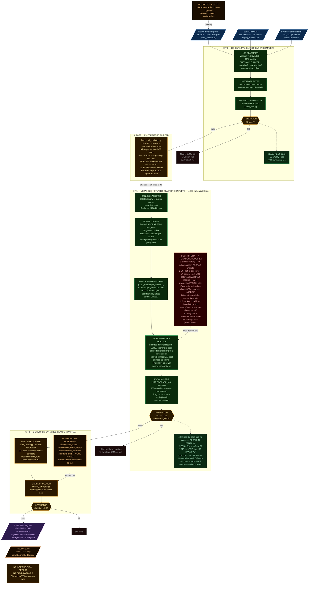

# Pipeline Process Diagrams

Three chemical process flow diagrams for the BNF soil microbiome pipeline. Read in order:

1. **Reference Model** — ideal 4-tier process derived from foundational design docs. The standard we are seeking to achieve.
2. **Current Implementation** — what is actually running as of 2026-03-10. Divergences from reference are annotated with reasons.
3. **High-Value Additions** — reference model plus eight prioritised additions that would materially increase scientific output.

Stream labels show population throughput (samples passing between unit operations). Unit operations are shown with key operating parameters.

---

## 1 — Reference Model

Standard we are seeking to achieve. Four-tier funnel from raw public metagenomes to field-ready intervention recommendations. Each tier reduces the candidate pool ~10× while increasing mechanistic resolution. All numbers are design targets, not actuals.

```mermaid
flowchart TB
    classDef feed fill:#0d2b4e,stroke:#4a90d9,color:#c9e6f8
    classDef unit fill:#0a2a0a,stroke:#2ecc71,color:#c8f0c8
    classDef sep fill:#2a1a00,stroke:#f39c12,color:#fdeaa7
    classDef prod fill:#2d1b4e,stroke:#9b59b6,color:#dab8f5
    classDef waste fill:#1a0a0a,stroke:#666,color:#999
    classDef recycle fill:#1a1a2e,stroke:#e74c3c,color:#fab1b1

    F1[/"NCBI SRA\nshotgun reads\n~2M samples"/]:::feed
    F2[/"EBI MGnify\nprocessed assemblies\n500k+ studies"/]:::feed
    F3[/"NEON · EMP · Qiita\namplicon + metadata"/]:::feed

    subgraph T0["① T0 — QUALITY & COMPOSITION FILTER   µs–ms per sample"]
        U0A["SEQUENCING QC\nmin 50k reads · chimera removal\ncontamination screen"]:::unit
        U0B["METADATA CLASSIFIER\nsoil pH · texture · land use · climate zone\nnifH functional gene presence/absence"]:::unit
        U0C["DIVERSITY ESTIMATOR\nShannon H · Chao1 · Faith PD\nPielou evenness"]:::unit
        S0{{"SEPARATOR\nt0_pass?"}}:::sep
    end

    subgraph T025["② T0.25 — ML FUNCTIONAL PREDICTOR   seconds per sample"]
        U025A["FUNCTIONAL PROFILER\nPICRUSt2 16S→KO pathway\nHUMAnN3 shotgun→MetaCyc\nFaProTax taxonomy→function"]:::unit
        U025B["ML CLASSIFIER\nRF/GBM on OTU table + metadata\nBNF activity score\nfeatures: top genera + pH + OM%"]:::unit
        U025C["SIMILARITY SEARCH\nBray-Curtis + UniFrac vs reference BNF DB\nmin similarity 0.3"]:::unit
        S025{{"SEPARATOR\nt025_pass?"}}:::sep
    end

    subgraph T1["③ T1 — METABOLIC NETWORK REACTOR   minutes per sample"]
        U1A["MAG BINNING\nMetaBat2/SemiBin from shotgun reads\nCheckM completeness filter\nper-sample genome bins"]:::unit
        U1B["GENOME ANNOTATOR\nDRAM/Prokka → KEGG + MetaCyc\nnifH · nifD · nifK confirmed per bin"]:::unit
        U1C["MODEL SYNTHESIZER\nCarveMe genome-scale SBML\nN-limited minimal medium\nMo-nitrogenase added if nifHDK+"]:::unit
        U1D["COMMUNITY FBA REACTOR\nisolated intracellular pools per organism\nshared extracellular pool\nbiomass objective\n90% growth constraint for FVA"]:::unit
        U1E["FVA ANALYZER\nNITROGENASE_MO reactions\nfva_max x2 = NH4-equiv flux\nunits: mmol NH4-equiv per gDW per h"]:::unit
        S1{{"SEPARATOR\nflux >= 0.01\nmmol NH4/gDW/h?"}}:::sep
    end

    subgraph T2["④ T2 — COMMUNITY DYNAMICS REACTOR   hours per sample"]
        U2A["dFBA TIME COURSE\n90-day growing season\nC/N/P depletion kinetics\nclimate perturbation panel"]:::unit
        U2B["PERTURBATION SCREEN\ndrought · heat · flood · pH shift\nstability score · resilience"]:::unit
        U2C["INTERVENTION REACTOR\nbioinoculant candidate screen\namendment effect model\nbiochar pH · compost N-release"]:::unit
        U2D["ESTABLISHMENT PREDICTOR\ncompetitive exclusion model\ninoculant survival vs resident community\nmin_establishment_prob 0.4"]:::unit
        S2{{"SEPARATOR\nstability >= 0.6\nestab >= 0.4?"}}:::sep
    end

    P1[/"TOP-50 BNF COMMUNITIES\nsoil context envelope\nkeystone taxa identified"/]:::prod
    P2[/"INTERVENTION REPORT\norganism · dose · timing\ncost per hectare"/]:::prod
    P3[/"FIELD VALIDATION PACKAGE\nsite selection map\n15N measurement protocol"/]:::prod
    REC(["FINDINGS FEEDBACK\nauto-detected patterns\ncalibrate filters"]):::recycle

    W0["discard ~90%"]:::waste
    W025["discard ~90%"]:::waste
    W1["discard ~90%"]:::waste
    W2["discard ~90%"]:::waste

    F1 & F2 & F3 --> U0A --> U0B --> U0C --> S0
    S0 -->|"~10% pass\n~200k samples"| U025A
    S0 -->|"~90% reject"| W0

    U025A --> U025B --> U025C --> S025
    S025 -->|"~10% pass\n~20k samples"| U1A
    S025 -->|"~90% reject"| W025

    U1A --> U1B --> U1C --> U1D --> U1E --> S1
    S1 -->|"~10% pass\n~2k samples"| U2A
    S1 -->|"~90% reject"| W1

    U2A --> U2B --> U2C --> U2D --> S2
    S2 -->|"~10% pass\ntop 200"| P1
    S2 -->|"~90% reject"| W2

    P1 --> P2 --> P3
    P1 -.->|recycle| REC
    REC -.->|calibrate| U0B
```

---

## 2 — Current Implementation

What is actually running as of 2026-03-10 (latest commit `f51cfef`). Orange = skipped or constrained. Red = bugs encountered (all fixed). Green = complete. Numbers from live DB query.

---

## 3 — High-Value Additions to Reference Model

Reference model (Diagram 1) plus eight additions (lettered A–H, purple) that would materially increase scientific value. Two feedback loops (blue) close the gap between computational predictions and real-world measurement.

| Addition | Unit Operation | Scientific Value |
|---|---|---|
| **A** — Metatranscriptomics | Expression Filter at T0 | Confirms nifH genes are actively transcribed, not just present; eliminates genomically-capable but transcriptionally-silent communities |
| **B** — 15N isotope dilution | Validation feedback loop | Ground-truth BNF rate from field; recalibrates the 0.01 mmol/gDW/h threshold against measured data |
| **C** — Surrogate FBA predictor | ML unit at T0.25 + training loop | After ~4k FBA runs, train ML to predict NITROGENASE_MO flux from 16S taxonomy; skips FBA for obvious pass/fail; improves over time |
| **D** — Metabolic exchange map | Cross-feeding network at T1 | Maps N/C/energy coupling between community members; identifies syntrophic pairs responsible for high BNF; improves keystone taxa precision |
| **E** — Agent-based model | ABM at T2 | Individual-based spatial dynamics (iDynoMiCS); strain-level competition for establishment; more accurate than population-level dFBA for inoculant survival |
| **F** — Spatial kriging | Post-processing | Kriging interpolation across NEON site coordinates → continuous BNF potential field map; enables site-specific field recommendations |
| **G** — Time-series tracking | Post-processing | Multi-visit NEON data → community BNF trajectory over seasons and years; detects stable vs transient high-BNF communities |
| **H** — Cross-pipeline optimizer | Post-processing | Joint ranking across BNF + C-sequestration + pathogen-suppression pipelines; identifies communities that excel at multiple soil health functions |

```mermaid
flowchart TB
    classDef feed fill:#0d2b4e,stroke:#4a90d9,color:#c9e6f8
    classDef unit fill:#0a2a0a,stroke:#2ecc71,color:#c8f0c8
    classDef sep fill:#2a1a00,stroke:#f39c12,color:#fdeaa7
    classDef prod fill:#2d1b4e,stroke:#9b59b6,color:#dab8f5
    classDef waste fill:#1a0a0a,stroke:#666,color:#999
    classDef add fill:#1a0d2e,stroke:#8e44ad,color:#d7bde2
    classDef val fill:#0d1f2e,stroke:#2980b9,color:#aed6f1

    F1[/"NCBI SRA\nshotgun reads\n~2M samples"/]:::feed
    F2[/"EBI MGnify\nprocessed assemblies\n500k+ studies"/]:::feed
    F3[/"NEON · EMP · Qiita\namplicon + metadata"/]:::feed
    FA1[/"METATRANSCRIPTOMICS\nmRNA from paired sites\nnifH expression ratios\nADDITION A"/]:::add
    FA2[/"15N FIELD MEASUREMENTS\nisotope dilution assay\nground-truth BNF rate/gDW/h\nADDITION B"/]:::add

    subgraph T0["① T0 — QUALITY & COMPOSITION FILTER"]
        U0A["SEQUENCING QC\nmin 50k reads · chimera removal"]:::unit
        U0B["METADATA CLASSIFIER\nsoil pH · texture · land use · nifH presence"]:::unit
        U0C["DIVERSITY ESTIMATOR\nShannon H · Chao1 · Faith PD"]:::unit
        U0D["EXPRESSION FILTER\nmrna_to_dna_ratio for nifH\nactive transcription required\nADDITION A"]:::add
        S0{{"SEPARATOR\nt0_pass?"}}:::sep
    end

    subgraph T025["② T0.25 — ML FUNCTIONAL PREDICTOR"]
        U025A["FUNCTIONAL PROFILER\nPICRUSt2 16S→KO\nHUMAnN3 shotgun→MetaCyc"]:::unit
        U025B["ML CLASSIFIER\nRF/GBM: OTU + metadata → BNF score"]:::unit
        U025C["SIMILARITY SEARCH\nBray-Curtis + UniFrac vs reference BNF DB"]:::unit
        U025D["SURROGATE FBA PREDICTOR\nML trained on T1 FVA outputs\npredict NITROGENASE_MO flux from 16S alone\nfast-lane: skip FBA for obvious cases\nADDITION C"]:::add
        S025{{"SEPARATOR\nt025_pass?"}}:::sep
    end

    subgraph T1["③ T1 — METABOLIC NETWORK REACTOR"]
        U1A["MAG BINNING\nMetaBat2/SemiBin · CheckM\nper-sample genome bins"]:::unit
        U1B["GENOME ANNOTATOR\nDRAM/Prokka → KEGG + MetaCyc\nnifH · nifD · nifK per bin"]:::unit
        U1C["MODEL SYNTHESIZER\nCarveMe genome-scale SBML\nMo-nitrogenase from annotation"]:::unit
        U1D["COMMUNITY FBA REACTOR\nN-limited minimal medium\nisolated intracellular pools per organism\nshared extracellular pool\nbiomass objective"]:::unit
        U1E["FVA ANALYZER\nNITROGENASE_MO · 90% growth"]:::unit
        U1F["METABOLIC EXCHANGE MAP\ncross-feeding network analysis\nN/C/energy coupling per pair\nidentify syntrophic keystones\nADDITION D"]:::add
        S1{{"SEPARATOR\nflux >= 0.01\nmmol NH4/gDW/h?"}}:::sep
    end

    subgraph T2["④ T2 — COMMUNITY DYNAMICS REACTOR"]
        U2A["dFBA TIME COURSE\n90-day season · C/N/P kinetics"]:::unit
        U2B["PERTURBATION SCREEN\ndrought · heat · pH shift"]:::unit
        U2C["INTERVENTION REACTOR\nbioinoculant screen · amendment model"]:::unit
        U2D["ESTABLISHMENT PREDICTOR\ncompetitive exclusion · population-level"]:::unit
        U2E["AGENT-BASED COMPETITION\niDynoMiCS individual-based model\nstrain-level spatial dynamics\nhigher accuracy for inoculant survival\nADDITION E"]:::add
        S2{{"SEPARATOR\nstability >= 0.6\nestab >= 0.4?"}}:::sep
    end

    subgraph POST["⑤ POST-PROCESSING — ADDITIONS F · G · H"]
        PP1["SPATIAL INTERPOLATOR\nKriging on NEON GPS coordinates\nBNF potential field map\ncontinuous geographic surface\nADDITION F"]:::add
        PP2["TIME-SERIES TRACKER\nmulti-visit NEON sites\ncommunity BNF trajectory\nstable vs transient high-BNF\nADDITION G"]:::add
        PP3["CROSS-PIPELINE OPTIMIZER\nBNF x C-sequestration x pathogen suppression\njoint community ranking\nsoil health index\nADDITION H"]:::add
    end

    P1[/"TOP-50 BNF COMMUNITIES\nsoil context envelope\nkeystone taxa + exchange network"/]:::prod
    P2[/"INTERVENTION REPORT\norganism · dose · timing\ncost per hectare + site map"/]:::prod
    P3[/"FIELD VALIDATION PACKAGE\nsite selection · 15N protocol\nground-truth measurement plan"/]:::prod

    VL["15N VALIDATION LOOP\nfield BNF rate vs predicted flux\nrecalibrate 0.01 threshold\nADDITION B"]:::val
    SL["SURROGATE TRAINING LOOP\nT1 FVA results → ML training set\napprox 4k runs = usable model\nimproves continuously\nADDITION C"]:::val

    W0["discard ~90%"]:::waste
    W025["discard ~90%"]:::waste
    W1["discard ~90%"]:::waste
    W2["discard ~90%"]:::waste

    FA1 --> U0D
    F1 & F2 & F3 --> U0A --> U0B --> U0C --> U0D --> S0
    S0 -->|"~10% pass"| U025A
    S0 -->|"~90% reject"| W0

    U025A --> U025B --> U025C --> U025D --> S025
    S025 -->|"~10% pass"| U1A
    S025 -->|"~90% reject"| W025

    U1A --> U1B --> U1C --> U1D --> U1E --> U1F --> S1
    S1 -->|"~10% pass"| U2A
    S1 -->|"~90% reject"| W1

    U2A --> U2B --> U2C --> U2D --> U2E --> S2
    S2 -->|"~10% pass"| P1
    S2 -->|"~90% reject"| W2

    P1 --> PP1 & PP2 & PP3
    PP1 & PP2 & PP3 --> P2 --> P3

    U1E -.->|"FVA training data"| SL
    SL -.->|"retrain surrogate"| U025D
    FA2 -.->|"measured field rates"| VL
    P1 -.->|"predicted flux"| VL
    VL -.->|"recalibrate threshold"| S1
```

---

## Divergence Summary — Reference vs Current

| Step | Reference | Current | Reason |
|---|---|---|---|
| **Input** | Shotgun metagenomes from SRA (millions) | 16S amplicon: NEON 17,567 + MGnify 95 + 440k synthetic | 16S APIs available first; SRA shotgun not yet triggered |
| **T0 method** | Multi-source QC + functional gene scan | vsearch 16S → SILVA 138 classification only | Sufficient for 16S; functional gene scan deferred to T1 genus lookup |
| **T0.25 ML** | PICRUSt2 → RF/GBM BNF score → similarity search | Skipped entirely | HUMAnN3 is shotgun-only; PICRUSt2 not wired into BNF config; no trained model |
| **T1 genome models** | CarveMe from per-sample MAG bins | Pre-built AGORA2 SBML, 20 genera on disk | CarveMe requires shotgun MAGs; genus-level proxy loses strain variation |
| **T1 nitrogenase** | Present from annotation-driven model build | Patched into 9 genera via patch_diazotroph_models.py | AGORA2 template omits nitrogenase; not a catalogued AGORA2 reaction |
| **T1 medium** | N-limited minimal medium from the start | 3 iterations to reach correct medium (commits 90f0e92 → 13ee41d → ad31e7b) | AGORA2 ships with complete medium; LP saturation and ATP-unbounded FVA not obvious until empirically observed |
| **T1 results** | ~2,000 high-confidence metabolic hits | 4,686 real t1_pass (3,845 BNF + 1,113 non-BNF) — **T1 RERUN PENDING** after metabolite-ns fix | Inflated avg 44.5 / max 108 mmol/gDW/h due to shared intracellular pools; fix committed ea2257f; rerun in progress (PID 573613) — expect max ≤45 on completion |
| **T2 real** | Run after T1 completes | Synthetic only (20k); real blocked until T1 BNF values stabilised | Needed stable T1 baseline before running expensive dFBA |
| **T2 intervention** | Full bioinoculant + amendment screen | Not implemented | Scripts exist but not wired into BNF config; downstream of T2 real |
| **Output** | Ranked communities + intervention report + field package | 4,686 t1_pass in DB; FINDINGS.md server-local; no report or field package | Blocked: report requires T2 intervention data |
| **BNF flux ceiling** | Theoretical max ~45 mmol/gDW/h per diazotroph at 10 mmol glucose | avg 44.5 on target; max 108 in multi-diazotroph communities — **fix committed** (metabolite-ns) | Root cause: shared intracellular metabolite pools let LP stack N×ATP from multiple organisms. Fixed: `_merge_community_models` now namespaces `atp_c → atp_c__org1` etc. while keeping extracellular pool shared. T1 rerun pending to confirm ≤45 ceiling. |
