# Pipeline State Snapshot — 2026-03-11 17:30 CST

Timestamped chemical process flow diagram of the **actual working pipeline** on hetzner2 as of this date.  
Commit: `2d39b42` · DB: `soil_microbiome.db` 528 MB · All numbers from live `sqlite3` queries.

Colour key: **green** = complete and operational · **orange** = partial / constrained · **red** = requires attention · **blue** = service · **dark** = feed/product stream.

```mermaid
flowchart TB
    classDef feed  fill:#0d2b4e,stroke:#4a90d9,color:#c9e6f8
    classDef unit  fill:#0a2a0a,stroke:#2ecc71,color:#c8f0c8
    classDef sep   fill:#2a1a00,stroke:#f39c12,color:#fdeaa7
    classDef prod  fill:#2d1b4e,stroke:#9b59b6,color:#dab8f5
    classDef waste fill:#1a0a0a,stroke:#666,color:#999
    classDef warn  fill:#1a0d00,stroke:#e67e22,color:#f0c080
    classDef done  fill:#0a2a12,stroke:#27ae60,color:#a9dfbf
    classDef skip  fill:#2a1800,stroke:#f39c12,color:#fdeaa7
    classDef alert fill:#2a0000,stroke:#c0392b,color:#e8b0b0
    classDef svc   fill:#0d1f2e,stroke:#2980b9,color:#aed6f1

    %% ── FEED STREAMS ──────────────────────────────────────────────────────────
    F1[/"NEON 16S amplicon\n17,567 samples · 47 sites\nHARV WOOD KONZ OSBS GUAN TALL + more"/]:::feed
    F2[/"EBI MGnify\n95 16S amplicon studies\nmgnify_adapter.py"/]:::feed
    F3[/"Synthetic communities\n220,000 · generated in-silico\nmodel validation only"/]:::feed
    FX["SRA shotgun · EMP · Qiita\nAdapters written — 0 samples ingested\nBlocked: no trigger yet"]:::warn

    %% ── T0 ─────────────────────────────────────────────────────────────────────
    subgraph T0["① T0 — 16S QUALITY + CLASSIFICATION   ✓ COMPLETE"]
        U0A["16S CLASSIFIER\nvsearch vs SILVA 138 V4 · 97% identity\nSUBSAMPLE_N=10k · maxrejects=8\nprocess_neon_16s.py"]:::unit
        U0B["METADATA FILTER\nsoil_ph · land_use · depth · seq depth\nquality_filter.py"]:::unit
        U0C["DIVERSITY ESTIMATOR\nShannon H · Chao1\nphylum profile + top 50 genera stored"]:::unit
        S0{{"t0_pass?"}}:::sep
        T0R["NEON 11,026 pass · 6,541 fail\nMGnify 95 pass · 0 fail\nSynthetic 220,000 pass\n─────────────────\nTotal t0_pass 231,121 / 237,662"]:::done
    end

    %% ── T0.25 ──────────────────────────────────────────────────────────────────
    subgraph T025["② T0.25 — ML FUNCTIONAL PREDICTOR   ✓ SURROGATE DEPLOYED"]
        U025A["FEATURE BUILDER\ntop genera + phylum profile + soil_ph\npathway stub: picrust2_runner.py\nPICRUSt2 ref DB not yet downloaded"]:::warn
        U025B["RF CLASSIFIER GATE\nbnf_surrogate_classifier.joblib\nROC-AUC 0.812 · OOB 0.772\nthreshold 0.4 · trained 5,907 samples"]:::unit
        U025C["RF REGRESSOR\nbnf_surrogate_regressor.joblib\nR² 0.465 · OOB 0.469\ntop feature soil_ph 42%\nNitrososphaerota 19% · Nitrospirota 12%"]:::unit
        S025{{"t025_pass?"}}:::sep
        T025R["NEON 3,564 pass\nMGnify 95 pass\nSynthetic 220,000 pass\n─────────────────\nTotal t025_pass 223,659\npredict_with_gate() wired · 2db435a"]:::done
    end

    %% ── T1 ─────────────────────────────────────────────────────────────────────
    subgraph T1["③ T1 — METABOLIC NETWORK REACTOR   ✓ COMPLETE · 4,830 pass"]
        U1A["GENUS CLASSIFIER\n16S vsearch top-hit → genus name\n100+ NCBI taxon IDs mapped · 2db435a\nProxy for MAG binning"]:::unit
        U1B["SBML MODEL LOOKUP\n20 AGORA2 genera on disk · 247 MB\nCarveMe 1.6.6 installed for new genera\nproteome cache 21 genera · 63 MB"]:::unit
        U1C["NITROGENASE PATCHER\n9 diazotroph genera patched · 90f0e92\nNITROGENASE_MO stoichiometry\nAzoarcus Azospirillum Azotobacter\nBradyrhizobium Burkholderia Herbaspirillum\nMesorhizobium Rhizobium Sinorhizobium"]:::unit
        U1D["COMMUNITY FBA REACTOR\nN-limited minimal medium · 28/357 exchanges\nisolated intracellular met pools per organism\nshared extracellular pool · biomass objective\nglpk solver enforced · c78a0bd"]:::unit
        U1E["FVA ANALYZER\nNITROGENASE_MO · 90% growth constraint\nfva_max x2 = NH4-equiv flux"]:::unit
        S1{{"flux >= 0.01\nmmol NH4/gDW/h?"}}:::sep
        T1R["NEON 4,768 pass · MGnify 62 pass\nmean flux 62.3 · max 378.4 mmol NH4/gDW/h\nkeystone taxa stored per community\n─────────────────\nTotal t1_pass 4,830\n339 newest NEON not yet through T2"]:::done
        T1W["FLUX CEILING ALERT\nDB max 378 mmol/gDW/h\nexceeds biological ceiling ~45\nCap constant 50 set but older\nruns may be uncapped\nAudit before publication"]:::alert
    end

    %% ── T2 ─────────────────────────────────────────────────────────────────────
    subgraph T2["④ T2 — COMMUNITY DYNAMICS REACTOR   ✓ COMPLETE · 3,378 pass"]
        U2A["dFBA TIME COURSE\nt2_dfba_batch.py · 4,491 communities run\n90-day growing season · C/N/P depletion\nclimate perturbation panel · glpk"]:::unit
        U2B["STABILITY SCORER\nstability_analyzer.py\nmean stability 0.959 · threshold 0.30\nmean estab_prob 0.93"]:::unit
        U2C["INTERVENTION PICKER\nmetadata-driven · bbf03a4\nsoil_ph → pH-amendment 58%\ndirect-inoculant 29% · diversity 8%\ndrought-tolerant 5%\nMechanistic screener wired · pending SBML"]:::warn
        S2{{"stability >= 0.30\nestab >= 0.40?"}}:::sep
        T2R["NEON 3,323 pass · MGnify 55 pass\nmean stability 0.959\n─────────────────\nTotal t2_pass 3,378\n339 new t1_pass not yet queued"]:::done
    end

    %% ── POST-PROCESSING ────────────────────────────────────────────────────────
    subgraph POST["⑤ POST-PROCESSING   COMPLETE"]
        PP1["SPATIAL KRIGING\nspatial_analysis.py · Mar 8\n6,413-point CONUS kriging grid\nresults/spatial/ · GPS + flux surface"]:::done
        PP2["CANDIDATE RANKER\nrank_candidates.py\n100 ranked BNF communities\nresults/ranked_candidates.csv"]:::done
        PP3["FINDINGS GENERATOR\nfindings_generator.py · 25de5c8\ncorrelation · taxa enrichment · spatial\nFINDINGS.md committed"]:::done
        PP4["INTERVENTION REPORT\nintervention_report.py\n11 field recommendations\nresults/intervention_report.md"]:::done
    end

    %% ── OUTPUTS ────────────────────────────────────────────────────────────────
    P1[/"3,378 t2_pass communities\nkeystone taxa + dFBA trajectories\n6,413-pt CONUS kriging surface"/]:::prod
    P2[/"100 ranked candidates\n11 intervention recommendations\nFINDINGS.md + intervention_report.md"/]:::prod

    %% ── ACTIVE SERVICE ─────────────────────────────────────────────────────────
    API["REST API\nuvicorn · PID 595903\n127.0.0.1:8000 · 2 workers\napi/main.py"]:::svc

    %% ── WASTE ──────────────────────────────────────────────────────────────────
    W0["T0 reject\nNEON 6,541 fail"]:::waste
    W1["T1 reject\n~6,198 no SBML genus\nCarveMe building new models"]:::waste
    W2["T2 reject\n1,452 stability below threshold"]:::waste

    %% ── EDGES ──────────────────────────────────────────────────────────────────
    F1 & F2 & F3 --> U0A
    FX -.->|"not yet connected"| U0A
    U0A --> U0B --> U0C --> S0
    S0 -->|"231,121 pass"| U025A
    S0 -->|"6,541 fail"| W0
    S0 -.-> T0R

    U025A --> U025B --> U025C --> S025
    S025 -->|"223,659 pass"| U1A
    S025 -.-> T025R

    U1A --> U1B --> U1C --> U1D --> U1E --> S1
    T1W -.->|"audit required"| U1E
    S1 -->|"4,830 pass"| U2A
    S1 -->|"~6,198 fail"| W1
    S1 -.-> T1R

    U2A --> U2B --> U2C --> S2
    S2 -->|"3,378 pass"| P1
    S2 -->|"~1,452 fail"| W2
    S2 -.-> T2R

    P1 --> PP1 & PP2 & PP3
    PP3 --> PP4
    PP1 & PP2 & PP4 --> P2
    P2 --> API
```

---

## State Summary

| Tier | Status | Communities in → out |
|---|---|---|
| **T0** 16S classifier | ✅ Complete | 237,662 → 231,121 pass |
| **T0.25** ML surrogate | ✅ Wired · `predict_with_gate()` | 231,121 → 223,659 pass |
| **T1** Community FBA | ✅ Complete · 4,830 pass | 223,659 eligible → 4,830 pass |
| **T2** dFBA + stability | ✅ Complete · 3,378 pass | 4,491 run → 3,378 pass *(339 new pending)* |
| **Post-processing** | ✅ Complete | Kriging · ranked list · findings · report |
| **REST API** | ✅ Running | `127.0.0.1:8000` · uvicorn · 2 workers |

## Open Items

| Item | Detail |
|---|---|
| **Flux ceiling audit** | DB max 378 mmol/gDW/h; biological ceiling ~45; pre-cap runs may still be in DB |
| **T2 re-run** | 339 new NEON t1_pass communities not yet through T2 dFBA |
| **PICRUSt2 ref DB** | `/data/pipeline/picrust2_ref/` empty — `picrust2 install` not yet run |
| **SRA / EMP / Qiita** | Adapters written; 0 samples ingested |
| **AGORA2 SBML coverage** | 20 genera on disk; CarveMe expanding per T1 run (100+ NCBI IDs now mapped) |
